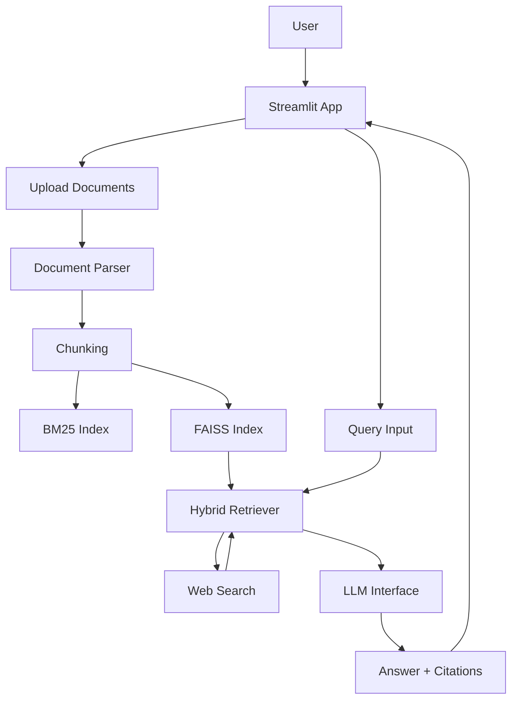

# Hybrid RAG Assistant: Document + Web Q&A

[](https://your-app.streamlit.app) <!-- Replace with actual deployment URL -->
[](LICENSE)
[](https://www.python.org/downloads/)
[](https://github.com/GZ30eee/hybrid-rag-assistant/actions)

## 🏗️ Tech Stack

| Component | Technology |
|-----------|------------|
| **LLM** | Google Gemini (with fallback support) |
| **Vector Database** | FAISS (v1) + Qdrant (optional, via abstraction) |
| **Search Engine** | BM25 (sparse) + Semantic (dense) Hybrid |
| **Orchestration** | LangChain (implicit) + LangGraph (planned) |
| **Frontend** | Streamlit |
| **Evaluation** | RAGAS |
| **Deployment** | Docker + Streamlit Cloud + GitHub Actions |

## ✨ Key Features

- 📄 **Multi-Format Document Support**: PDF, DOCX, TXT, HTML, CSV.
- 🔍 **Hybrid Retrieval**: Combines BM25 keyword search with FAISS dense retrieval.
- 🌐 **Live Web Search**: Integrates with SerpAPI to augment local knowledge.
- 🤖 **LLM-Powered Answers**: Uses Gemini to generate concise, citable answers and "web‑ready" paragraphs.
- ⚙️ **Advanced Configuration**: Adjustable alpha, chunking, embedding models, and LLM parameters.
- 💾 **Session & History**: Persistent query history with export.
- 🎨 **Modern UI**: Clean, responsive Streamlit interface.

---

## 🏗️ Architecture Overview



---

## 🛠️ Installation & Setup

### Prerequisites
- Python 3.8+
- [Google Gemini API Key](https://aistudio.google.com/app/apikey)
- (Optional) [SerpAPI Key](https://serpapi.com/) for web search

### Step 1: Clone
```bash
git clone https://github.com/GZ30eee/hybrid-rag-assistant.git
cd hybrid-rag-assistant
```

### Step 2: Install Dependencies
```bash
pip install -r requirements.txt
```

### Step 3: Configure Secrets
Create a `.streamlit/secrets.toml` file (or set environment variables):
```toml
GEMINI_API_KEY = "your_gemini_key"
WEB_SEARCH_API_KEY = "your_serpapi_key"  # optional
```

### Step 4: Run
```bash
streamlit run app.py
```

---

## 📂 Project Structure

```
hybrid-rag-assistant/
├── app.py
├── core/
│   ├── document_parser.py
│   ├── hybrid_retriever.py
│   ├── llm_interface.py
│   ├── session_manager.py
│   ├── vector_store.py       # NEW: abstract vector store + Qdrant
│   └── web_search.py
├── evaluation/               # NEW: RAGAS harness
│   ├── ragas_eval.py
│   └── test_data/
│       └── sample_qa.json
├── benchmarks/               # NEW: performance benchmarks
│   └── benchmark.py
├── docs/
│   └── architecture.mermaid  # NEW: diagram source
├── tests/                    # (expand with unit tests)
├── .github/workflows/ci.yml  # NEW: CI/CD
├── Dockerfile                # NEW
├── .dockerignore             # NEW
├── .pre-commit-config.yaml   # NEW
├── pyproject.toml            # NEW
├── requirements.txt
├── .gitignore
├── LICENSE                   # NEW
├── CONTRIBUTING.md           # NEW
└── CODE_OF_CONDUCT.md        # NEW
```

---

## 🗺️ Future Work

While functional, this is a **v1 prototype**. I am currently implementing:

- **RAGAS Evaluation Harness** – to measure retrieval accuracy, context relevancy, and faithfulness.
- **Vector DB Migration** – integrating Qdrant (or pgvector) for production‑scale indexing.
- **LangGraph Orchestration** – for multi‑step reasoning and tool usage.
- **OCR Enhancement** – better support for scanned PDFs.
- **Multi‑User Persistence** – database backend for session history.

---

## 🤝 Contributing

Contributions are welcome! Please read [CONTRIBUTING.md](CONTRIBUTING.md) for guidelines.

## 📄 License

This project is licensed under the MIT License – see the [LICENSE](LICENSE) file.
